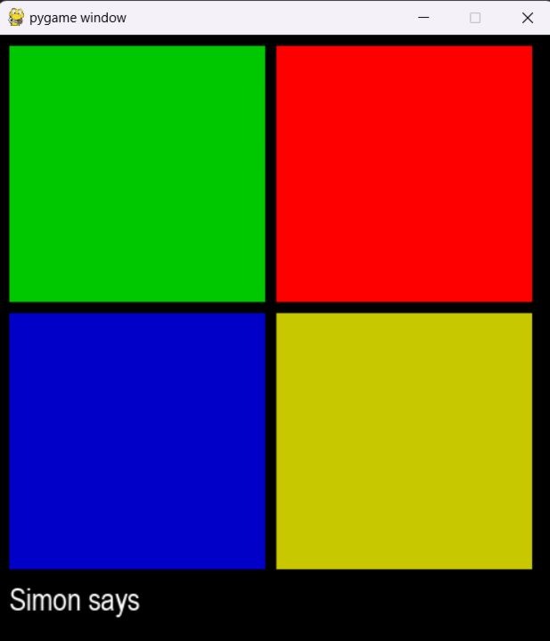

# Bootstrap Project
## A Python Pygame project about the Simon Says game.

## How to play
### 1 - Run the game
### 2 - Let the CPU runs the color sequence
### 3 - Repeat that sequence yourself
### 4 - Success earns you 1 point, Failure leads to game over
### 5 - You can check your score, highest score, and reset the game when the game ends

